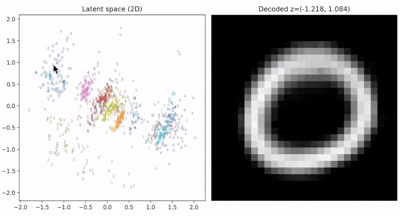

# vit-ai

ViT autoencoder compressing MNIST images to a 2D latent space.



## Setup

```bash
python3 -m venv .venv
source .venv/bin/activate
pip install -r requirements.txt
```

Install PyTorch for your platform: https://pytorch.org/get-started/locally/

## Usage

```bash
python3 train.py
python3 evaluate.py
python3 demo.py
```

## Data split

Full MNIST (70k) is shuffled once with `--seed` (default 42):

| split | size | used in |
|-------|------|---------|
| test | 1000 | `evaluate.py` only |
| val | 1000 | early stopping |
| train | 1000 default | `train.py` (`--train-size 0` for all remaining ~68k) |

Indices are saved under the run dir as `test_indices.json` and `train_indices.json`.

## Training

MSE reconstruction, AdamW, early stopping on val MSE. Each validation step writes `distribution.png` and a numbered frame; at the end frames are assembled into `training.gif` and deleted.

```bash
python3 train.py --train-size 0 --epochs 500 --patience 30 --min-delta 1e-5
```

Outputs go to `runs/mnist_ae/` by default (`best.pt`, `run_meta.json`, `distribution.png`, `training.gif`).

## Demo

Interactive latent plot; hover left panel to decode on the right. Uses memmap MNIST from `~/.cache/vit-ai` so reads don't depend on `data/` being fully local (e.g. iCloud Desktop).

```bash
python3 demo.py --checkpoint runs/mnist_ae/best.pt --n-samples 1000
```
